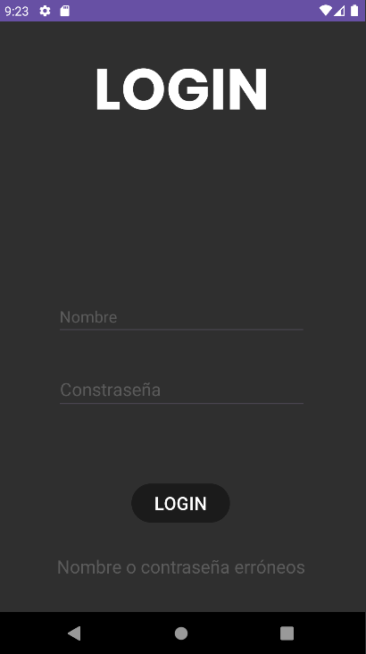
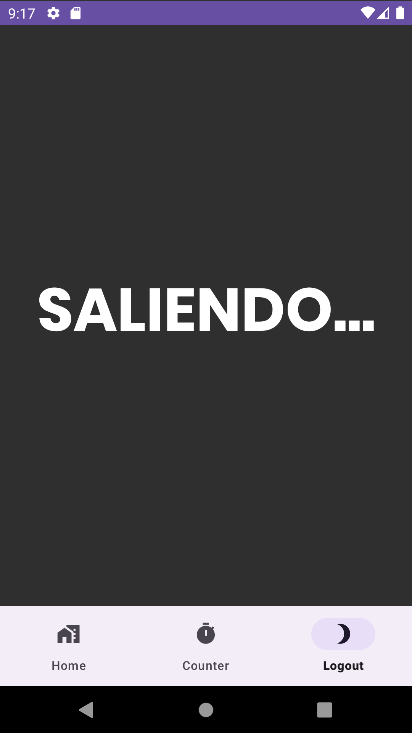

# ANDROID
# Tarea 4
- **Autor**: *José Antonio Pérez de Prada*
- **Asignatura**: Multimedia

## Enunciado
Añade un Fragment mas que se llame API y sigue el tutorial (para la parte del consumo de la API) proporcionado para consumir un API con android(en esta entrega no tendrás que reflejar los resultado en la interfaz gráfica, solo en el log). Por otro lado crea un microservicio con una sola entidad.

## Resultado
### Ventanas
Este ejercicio cuenta con dos ventanas:

#### Ventana de Login

Es la vetana principal del proyecto, es decir, es con la que se iniciará la aplicación. Para acceder a la segunda ventana de la aplicación, el usuario deberá introducir un nombre y una contraseña concretos, los cuales como se pide en el enunciado son en ambos casos *admin*. Esta ventana no ha sido modificada desde el ejercicio 2.

Como se vio en el ejercicio 2, la ventana de login es la que nos permitirá o no acceder al resto del contenido de la aplicación. Si se introduce de forma incorrecta el usuario, la contraseña o ambas a la vez, aparecerá un texto en la parte inferior de la ventana en el que indicará que nos hemos equivocado y tendremos que intentarlo de nuevo.

Si la contraseña y el usuario son correctos, nos dejará acceder a la segunda ventana de la aplicación.

#### Ventana principal donde se muestran los fragments

Esta es la ventana que se mostrará tras introducir correctamente el nombre y la contraseña. A diferencia del ejercicio anterior, en esta ventana se muestran el **fragmentContainerView** y el **bottomNavigationView**.

- El **fragmentNavigationView** es donde se mostrarán los fragments de la aplicación. En este caso tenemos 2 fragments más a parte del que se ve en la captura que se mostrarán más adelante.

- El **bottomNavigationView** es el encargado de que podamos visualizar los fragments. Dicho de otra forma, es el encargado de que podamos cambiar de un fragment a otro.

Cuando pulsamos alguna de las dos otras opciones del **bottomNavigationView** podemos a ir a alguna de estos fragments:

### Con el botón de Counter:

El contador sigue sin hacer nada, pero en este caso lo que hemos hecho es cambiarlo de una actividad a un fragment.

### Con el botón de Logout:

Este fragment es como el fragment de Home, pero en el caso de que fuera una aplicación realista, este fragment mostraría la opción de poder salir de la aplicación pulsando un botón.

### ACTUALIZACIÓN DEL EJERCICIO 4

### Con el botón de API

En este fragment, al igual que en Home y en Logout solo se muestra un texto que, en este caso, es el nombre del método que permite obtener la lista de los productos de la api.

Al pulsarse el botón de **API** se inicia el evento que permite obtener de la API los datos de todos los productos registrados que, en este caso, son los siguientes:

